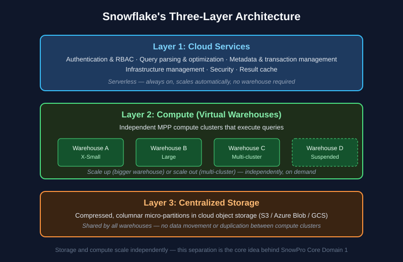

# Chapter 1: Snowflake Architecture Fundamentals — SnowPro Core Study Notes

**Maps to official exam domain:** Snowflake AI Data Cloud Features & Architecture (**31%** of COF-C03 — the largest single domain)

**Prerequisite chapters:** none — start here.

**Next chapter:** [Chapter 2 — Virtual Warehouses & Compute](../02-virtual-warehouses-compute/README.md)

---

## Why this chapter matters

Architecture is the single heaviest domain on the SnowPro Core (COF-C03) exam, and nearly every other chapter in this guide leans on it. If you only have time to deeply master one chapter, make it this one.

## 1.1 What Snowflake actually is

Snowflake is a **cloud-native data platform** delivered as Software-as-a-Service (SaaS), built on top of a public cloud provider (AWS, Azure, or GCP). Critically, Snowflake is **not** a modified version of a traditional database (like Postgres or a Hadoop distribution) — its architecture was purpose-built from scratch for the cloud.

The single most important architectural idea to internalize for the exam: **Snowflake separates storage and compute into independently scaling layers.** This one concept explains a huge share of exam questions about cost, performance, and concurrency.


*Snowflake's three-layer architecture — storage, compute, and cloud services scale independently. See [Snowflake's official architecture docs](https://docs.snowflake.com/en/user-guide/intro-key-concepts) for the canonical explanation.*

## 1.2 The three layers, in exam-relevant detail

### Layer 1: Cloud Services

The "brain" of Snowflake. This layer is **serverless** — it's always running, you don't provision it, and you're not directly billed compute credits for most of its work (though very heavy metadata/compilation work can incur "cloud services" charges beyond a daily free allowance).

Responsibilities include:
- Authentication and access control (RBAC enforcement)
- Query parsing, optimization, and compilation
- Metadata management (table statistics, micro-partition metadata)
- Infrastructure orchestration
- The **result cache** (see Chapter 6 for how this affects performance)

**Exam tip:** if a question describes something happening *before* a query touches actual data — parsing, optimizing, checking permissions — that's Cloud Services.

### Layer 2: Compute (Virtual Warehouses)

The "muscle." Virtual warehouses are clusters of compute resources (Snowflake calls the underlying nodes "servers") that actually execute queries and DML. Each warehouse is an independent MPP (massively parallel processing) compute cluster.

Key properties:
- Multiple warehouses can query the **same data simultaneously** without contention, because they don't share compute — this is how Snowflake avoids the classic "one big cluster, everyone fights for resources" problem.
- Warehouses can be resized ("scale up") or configured as multi-cluster ("scale out") independently of one another.
- You pay for warehouse compute by the second (with a 60-second minimum) only while a warehouse is running.

Full detail on sizing and scaling is in [Chapter 2](../02-virtual-warehouses-compute/README.md).

### Layer 3: Centralized (Database) Storage

Snowflake stores all data — structured and semi-structured — in a **compressed, columnar, optimized format** on cloud object storage (Amazon S3, Azure Blob Storage, or Google Cloud Storage, depending on which cloud your account runs on). Data is automatically organized into immutable, self-describing units called **micro-partitions**.

Because storage is centralized and shared, **any warehouse with the right privileges can query the same data without copying it.** This is what makes Snowflake's data sharing features (Chapter 7) possible without physically duplicating data between accounts.

## 1.3 Micro-partitions (know this cold)

Micro-partitions are the physical storage unit underlying every Snowflake table. Key facts frequently tested:

- Each micro-partition holds between 50MB and 500MB of **uncompressed** data (compressed size on disk is smaller).
- Data is stored in a **columnar** format within each micro-partition.
- Snowflake automatically collects **metadata** about each micro-partition: min/max values per column, number of distinct values, and more. This metadata lives in the Cloud Services layer.
- This metadata enables **pruning** — Snowflake can skip micro-partitions entirely if it knows (from the metadata) that they can't contain rows matching a query's filter. This is one of the biggest performance levers in Snowflake and is covered in depth in [Chapter 6](../06-performance-optimization-querying/README.md).
- Micro-partitions are **immutable** — updates/deletes create new micro-partitions rather than modifying existing ones in place. This is also foundational to how Time Travel works (Chapter 7).

## 1.4 Snowflake editions

Feature availability differs by edition — the exam tests which features require which edition tier.

| Edition | Notable exam-relevant features |
|---|---|
| **Standard** | Core SQL, standard support, 1-day (24 hr) default Time Travel |
| **Enterprise** | Everything in Standard + up to 90-day Time Travel, multi-cluster warehouses, materialized views, search optimization, column-level security |
| **Business Critical** | Everything in Enterprise + higher security/compliance (HIPAA, PCI), database failover/failback, Tri-Secret Secure |
| **Virtual Private Snowflake (VPS)** | Highest isolation tier — dedicated, isolated infrastructure for the most regulated customers |

**Exam tip:** "90-day Time Travel" and "multi-cluster warehouses" being Enterprise-and-above features is a commonly tested fact.

## 1.5 Object hierarchy

Snowflake's logical object hierarchy, top to bottom:

```
Organization
  └── Account
        └── Database
              └── Schema
                    └── Table / View / Stage / File Format / Stream / Task / Function / Procedure...
```

Every object lives inside a schema, every schema lives inside a database, and every database lives inside an account. Roles and warehouses are account-level objects, not tied to a single database.

## 1.6 Data protection features that live in this domain

A few storage-layer features are commonly tested alongside architecture, even though they're explored in full in [Chapter 7](../07-data-protection-sharing-collaboration/README.md):

- **Time Travel** — query or restore data as it existed at a past point in time (default 1 day on Standard, up to 90 days on Enterprise+), enabled by the immutability of micro-partitions.
- **Fail-safe** — a non-configurable 7-day period *after* Time Travel expires, during which Snowflake (not you) can potentially recover data — a last-resort disaster recovery mechanism, not a self-service feature.
- **Zero-copy cloning** — instantly create a full copy of a table, schema, or database that shares the same underlying micro-partitions until either copy changes. Clones are metadata operations, not physical data copies, which is why they're near-instant regardless of table size.

## 1.7 Caching layers (preview — full detail in Chapter 6)

Three caching layers exist in Snowflake's architecture, and knowing *which layer* each lives in is a common exam trap:

| Cache | Lives in | Survives warehouse suspend? |
|---|---|---|
| Result cache | Cloud Services | Yes — persists up to 24 hours, independent of any warehouse |
| Local disk (warehouse) cache | Compute | No — cleared when the warehouse suspends |
| Metadata cache | Cloud Services | Yes — used for pruning decisions |

## Key takeaways

- Storage and compute are separated and scale independently — this is *the* foundational Snowflake architecture concept.
- Micro-partitions are immutable, columnar, ~50–500MB (uncompressed), and carry metadata that enables pruning.
- Edition tier gates access to features like 90-day Time Travel and multi-cluster warehouses.
- Zero-copy clones and Time Travel are possible because of how storage is structured, not bolted-on features.

## Official documentation for further reading

- [Snowflake key concepts & architecture](https://docs.snowflake.com/en/user-guide/intro-key-concepts)
- [Micro-partitions & data clustering](https://docs.snowflake.com/en/user-guide/tables-clustering-micropartitions)
- [Snowflake editions](https://docs.snowflake.com/en/user-guide/intro-editions)
- [Time Travel](https://docs.snowflake.com/en/user-guide/data-time-travel)
- [Cloning objects](https://docs.snowflake.com/en/user-guide/object-clone)

---

**Next:** [Chapter 2 — Virtual Warehouses & Compute →](../02-virtual-warehouses-compute/README.md)
**Test yourself:** [Chapter 1 practice questions →](QUESTIONS.md)
