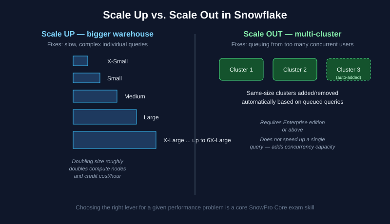

# Chapter 2: Virtual Warehouses & Compute — SnowPro Core Study Notes

**Maps to official exam domain:** Snowflake AI Data Cloud Features & Architecture (**31%** of COF-C03)

**Prerequisite chapters:** [Chapter 1 — Architecture Fundamentals](../01-architecture-fundamentals/README.md)

**Next chapter:** [Chapter 3 — Account Access, Security & Governance](../03-account-access-security-governance/README.md)

---

## Why this chapter matters

Virtual warehouses are the compute engine behind every query, load, and transformation in Snowflake, and warehouse-sizing scenario questions ("a team complains queries are slow / queuing — what do you change?") are among the most common question patterns on SnowPro Core.

## 2.1 What a virtual warehouse is

A virtual warehouse is a cluster of compute resources — CPU, memory, and temporary local disk (SSD) storage — that Snowflake provisions on demand to execute SQL statements: queries, DML, loads, and unloads. Warehouses are **independent** of each other and of the storage layer; multiple warehouses can query the same tables at the same time with zero resource contention between them.

Warehouses are billed in **Snowflake credits**, consumed per-second (with a 60-second minimum per resume) only while the warehouse is running.

## 2.2 Warehouse sizes ("T-shirt sizing")

Warehouses come in T-shirt sizes, from **X-Small up to 6X-Large**. Each size step roughly **doubles** the compute resources (and credit cost per hour) of the size below it.

| Size | Relative credits/hour |
|---|---|
| X-Small | 1 |
| Small | 2 |
| Medium | 4 |
| Large | 8 |
| X-Large | 16 |
| 2X-Large | 32 |
| ... up to 6X-Large | 512 |

**Exam tip:** you don't need to memorize exact credit numbers, but you should know the doubling pattern and that bigger warehouses cost more per hour but may finish work faster — bigger isn't automatically "more expensive overall" if it finishes proportionally faster.

## 2.3 Scale up vs. scale out (a very commonly tested distinction)

*Scale up fixes slow individual queries; scale out fixes queuing from concurrent users. See [Snowflake's warehouse docs](https://docs.snowflake.com/en/user-guide/warehouses-overview) for full detail.*

- **Scale up** = increase the warehouse **size**. Use this when individual queries are complex/slow (e.g., large joins, aggregations over huge datasets) and need more raw compute per query.
- **Scale out** = use a **multi-cluster warehouse**, which adds additional clusters of the *same size* automatically as concurrent query volume increases, and removes them as it drops. Use this when queries are individually fine but users are experiencing **queuing** because too many queries are competing for one cluster's resources. Multi-cluster warehouses require **Enterprise edition or above**.

**Common exam trap:** making a warehouse bigger does **not** fix a concurrency/queuing problem — that requires scaling out (multi-cluster), not up.

## 2.4 Auto-suspend and auto-resume

Every warehouse can be configured with:

- **Auto-suspend**: automatically pause the warehouse after N seconds/minutes of inactivity, so you stop paying credits when nobody's using it.
- **Auto-resume**: automatically start the warehouse the instant a new query is submitted against it.

Together, these are the single biggest lever for controlling Snowflake compute costs without sacrificing usability — there's rarely a good reason to leave auto-suspend disabled on a general-purpose warehouse.

**Exam tip:** a warehouse that's suspended costs nothing in compute credits, but resuming it has a brief "cold start" and clears the local disk (warehouse) cache — see Chapter 6 for how this interacts with performance.

## 2.5 Multi-cluster warehouse modes

When configuring a multi-cluster warehouse, you choose a scaling policy:

- **Standard** (default): favors starting additional clusters quickly to minimize queuing, even if it means running clusters that aren't fully utilized.
- **Economy**: favors conserving credits, waiting longer before adding a cluster, accepting some queuing in exchange for lower cost.

You also configure **Min** and **Max** cluster counts — Min is how many clusters always run (can be 1), Max is the ceiling Snowflake won't exceed regardless of demand.

## 2.6 Warehouses and workload isolation

A best practice frequently referenced in scenario questions: use **separate warehouses for separate workloads** (e.g., one for ELT/loading, one for BI/reporting, one for data science) even though they can all query the same underlying data. This avoids one heavy workload (like a large batch load) starving another (like dashboard queries) of compute, since each warehouse has its own dedicated resources.

## 2.7 Serverless features (compute without warehouses)

Some Snowflake features run on Snowflake-managed compute rather than a warehouse you provision — these are billed separately and don't require you to size or manage a warehouse:

- **Snowpipe** (continuous data loading — Chapter 4)
- **Automatic clustering** (background reclustering of clustered tables — Chapter 6)
- **Search Optimization Service maintenance** (Chapter 6)
- **Materialized view maintenance** (Chapter 6)
- **Tasks**, when configured to use "serverless compute" instead of a user warehouse (Chapter 5)

**Exam tip:** if a question describes a Snowflake feature running "in the background" without you managing a warehouse for it, think serverless compute.

## Key takeaways

- Scale **up** (bigger warehouse) for slow individual queries; scale **out** (multi-cluster) for concurrency/queuing — this distinction is heavily tested.
- Warehouses bill per-second with a 60-second minimum, only while running.
- Auto-suspend/auto-resume is the primary cost control lever for warehouses.
- Multi-cluster warehouses require Enterprise edition or above.
- Several Snowflake features (Snowpipe, auto-clustering, materialized view maintenance) run on serverless compute, not a warehouse you size yourself.

## Official documentation for further reading

- [Overview of warehouses](https://docs.snowflake.com/en/user-guide/warehouses-overview)
- [Multi-cluster warehouses](https://docs.snowflake.com/en/user-guide/warehouses-multicluster)
- [Warehouse considerations](https://docs.snowflake.com/en/user-guide/warehouses-considerations)

---

**Previous:** [← Chapter 1 — Architecture Fundamentals](../01-architecture-fundamentals/README.md)
**Next:** [Chapter 3 — Account Access, Security & Governance →](../03-account-access-security-governance/README.md)
**Test yourself:** [Chapter 2 practice questions →](QUESTIONS.md)
