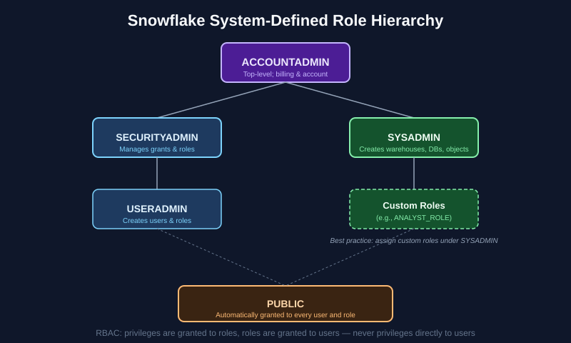

# Chapter 3: Account Access, Security & Data Governance — SnowPro Core Study Notes

**Maps to official exam domain:** Account Management & Data Governance (**20%** of COF-C03)

**Prerequisite chapters:** [Chapter 1](../01-architecture-fundamentals/README.md), [Chapter 2](../02-virtual-warehouses-compute/README.md)

**Next chapter:** [Chapter 4 — Data Loading, Unloading & Connectivity](../04-data-loading-unloading-connectivity/README.md)

---

## Why this chapter matters

This domain is worth a full 20% of the exam on its own, and its concepts (roles, privileges, policies) show up embedded in scenario questions across other domains too — a solid handle on RBAC pays off everywhere.

## 3.1 Role-Based Access Control (RBAC) — the core model

Snowflake access control is built on RBAC: **privileges are granted to roles, and roles are granted to users** (or to other roles). You (almost) never grant a privilege directly to a user.

*Snowflake's default system role hierarchy. See [Snowflake's access control docs](https://docs.snowflake.com/en/user-guide/security-access-control-overview) for the canonical reference.*

### System-defined roles (memorize these)

| Role | Purpose |
|---|---|
| **ACCOUNTADMIN** | Top-level role; encapsulates SECURITYADMIN and SYSADMIN; manages billing and the account itself. Should be granted to very few users. |
| **SECURITYADMIN** | Manages grants globally, and can manage users and roles (inherits USERADMIN). |
| **USERADMIN** | Dedicated to creating and managing users and roles. |
| **SYSADMIN** | Has privileges to create warehouses, databases, and other objects. Best practice: create custom roles as children of SYSADMIN so admins retain visibility/control over all objects. |
| **PUBLIC** | Automatically available to every user and role in the account; anything granted to PUBLIC is implicitly available to everyone. |

**Exam tip:** a very common scenario question pattern is "which role should be used to perform X" — know that object creation privileges default toward SYSADMIN, user/role management toward USERADMIN/SECURITYADMIN, and that ACCOUNTADMIN is reserved for account-level administrative tasks, not day-to-day object management.

### Custom roles

Organizations create custom roles (e.g., `ANALYST_ROLE`, `DATA_ENGINEER_ROLE`) to model real job functions. Best practice is to assign custom roles as children of `SYSADMIN` in the role hierarchy so that `SYSADMIN` (and `ACCOUNTADMIN` above it) retains oversight of all account objects.

### Secondary roles

A user can activate a **primary role** (the one used for object creation/ownership context) plus **secondary roles** simultaneously, which lets a single session combine privileges from multiple roles at once — useful for users who need combined access without needing a single role that grants everything.

## 3.2 Authentication methods

SnowPro Core expects familiarity with Snowflake's supported authentication mechanisms:

- **Username/password** (baseline, least secure alone)
- **Multi-factor authentication (MFA)** — via Duo Security integration
- **Single sign-on (SSO) / SAML 2.0** — federated authentication through an identity provider (Okta, Azure AD, etc.)
- **Key pair authentication** — public/private key pairs, commonly used for service accounts, scripts, and connectors instead of passwords
- **OAuth** — either Snowflake-provided OAuth or a configured external OAuth provider, common for application/BI-tool integrations

**Exam tip:** key pair authentication is the standard recommendation for automated/programmatic connections (drivers, connectors, CI/CD) rather than embedding a username/password.

## 3.3 Network policies and private connectivity

- **Network policies** restrict account or user access to specific IP address ranges (allow lists and block lists), enforced at the Cloud Services layer before authentication even completes.
- **Private connectivity** (e.g., AWS PrivateLink, Azure Private Link) allows traffic between a customer's private network and Snowflake to stay off the public internet entirely — an option for higher-security environments, generally available on Business Critical edition and above.

## 3.4 Data governance features

### Dynamic data masking

**Masking policies** are schema-level objects that conditionally mask column data at query time based on who's querying — e.g., showing a masked value like `XXX-XX-1234` to most roles but the real SSN to an authorized role. Masking is applied dynamically; the underlying stored data is never altered.

### Row access policies

**Row access policies** restrict which *rows* a given role/user can see in a table's result set — for example, a sales rep role only sees rows for their own region. Like masking policies, they're evaluated dynamically at query time and don't change stored data.

### Object tagging

**Tags** are schema-level objects that can be attached to tables, columns, warehouses, and other objects to classify them (e.g., tagging a column `PII = true`). Tags support governance workflows like discovering sensitive data across an account and can trigger masking policies automatically when combined with **tag-based masking**.

### Access history and account usage

The `SNOWFLAKE.ACCOUNT_USAGE` schema (and `ACCESS_HISTORY` view specifically) provides auditable records of who queried what data and when — foundational for compliance and lineage use cases.

## 3.5 Resource monitors (cost governance)

**Resource monitors** track warehouse credit consumption against a defined quota and can trigger actions at defined thresholds — such as sending a notification, or automatically suspending warehouses — to prevent runaway compute spend. This is a governance/cost-control feature commonly tested alongside RBAC.

## Key takeaways

- RBAC in Snowflake: privileges → roles → users. Know the five system-defined roles and their scope.
- Custom roles should typically be created as children of SYSADMIN.
- Key pair authentication is the standard for service accounts/automation; MFA and SSO/SAML are standard for human users.
- Masking policies control *column* visibility; row access policies control *row* visibility — both are dynamic, not physical data changes.
- Resource monitors provide automated cost governance for warehouse spend.

## Official documentation for further reading

- [Overview of Access Control](https://docs.snowflake.com/en/user-guide/security-access-control-overview)
- [Using Dynamic Data Masking](https://docs.snowflake.com/en/user-guide/security-column-ddm-use)
- [Using Row Access Policies](https://docs.snowflake.com/en/user-guide/security-row-intro)
- [Network Policies](https://docs.snowflake.com/en/user-guide/network-policies)
- [Resource Monitors](https://docs.snowflake.com/en/user-guide/resource-monitors)

---

**Previous:** [← Chapter 2 — Virtual Warehouses & Compute](../02-virtual-warehouses-compute/README.md)
**Next:** [Chapter 4 — Data Loading, Unloading & Connectivity →](../04-data-loading-unloading-connectivity/README.md)
**Test yourself:** [Chapter 3 practice questions →](QUESTIONS.md)
