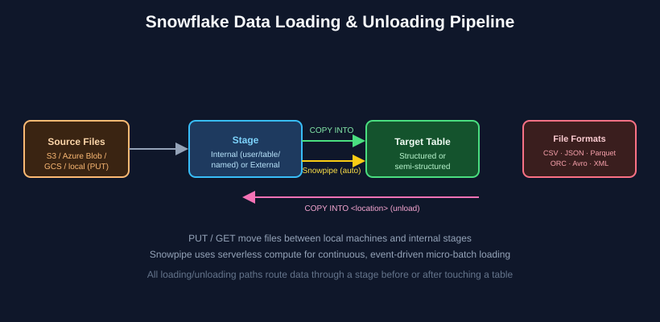

# Chapter 4: Data Loading, Unloading & Connectivity — SnowPro Core Study Notes

**Maps to official exam domain:** Data Loading, Unloading & Connectivity (**18%** of COF-C03)

**Prerequisite chapters:** [Chapter 1](../01-architecture-fundamentals/README.md), [Chapter 2](../02-virtual-warehouses-compute/README.md)

**Next chapter:** [Chapter 5 — Data Transformation & Semi-Structured Data](../05-data-transformation-semi-structured/README.md)

---

## Why this chapter matters

Getting data in and out of Snowflake correctly — and knowing which mechanism fits which scenario (batch vs. streaming, internal vs. external) — is a practical skill this domain tests heavily through scenario questions.

## 4.1 Stages — the staging area for all file-based loading

A **stage** is a location where data files are stored before loading into a table (or after unloading from one). Every load/unload operation involves a stage.

*Files move through a stage on their way into or out of Snowflake tables. See [Snowflake's stage docs](https://docs.snowflake.com/en/user-guide/data-load-overview) for full detail.*

### Internal stages (files stored inside Snowflake)

| Stage type | Scope |
|---|---|
| **User stage** (`@~`) | Automatically created per user; not shareable with other users; good for personal ad hoc loads |
| **Table stage** (`@%table_name`) | Automatically created per table; tied 1:1 to that table; can't be altered/dropped independently |
| **Named internal stage** | Explicitly created database object (`CREATE STAGE`); shareable across users/roles via grants; the most flexible internal option |

### External stages (files stored outside Snowflake)

References to files sitting in a cloud storage bucket you control: **Amazon S3**, **Azure Blob Storage**, or **Google Cloud Storage**. Requires a storage integration or credentials to authenticate to that external location.

**Exam tip:** table stages cannot be granted to other roles — if a scenario requires shared access to staged files, that rules out the table stage and points to a named internal stage or external stage.

## 4.2 Loading data: COPY INTO \<table\>

`COPY INTO <table>` is the primary bulk-loading command. Key behaviors worth memorizing:

- It's **idempotent by default** for a given stage/path combination — Snowflake uses load metadata to avoid reloading the exact same file twice, even if you rerun the same `COPY INTO` command.
- Supports `ON_ERROR` options (e.g., `CONTINUE`, `SKIP_FILE`, `ABORT_STATEMENT`) to control error handling behavior during a load.
- Works against both internal and external stages.
- Loading runs on a **user-managed virtual warehouse** you specify (unlike Snowpipe, which is serverless).

## 4.3 Snowpipe and Snowpipe Streaming (continuous loading)

- **Snowpipe** enables **continuous, automated loading** of new files as they land in a stage, typically triggered by cloud storage event notifications. It runs on **Snowflake-managed serverless compute**, not a warehouse you provision, and loads data in micro-batches shortly after files arrive.
- **Snowpipe Streaming** goes further, allowing rows to be streamed directly into Snowflake tables **without staging files first**, for lower-latency, row-level ingestion use cases (e.g., streaming application/IoT events).

**Exam tip:** a scenario describing "files periodically land in cloud storage and need to be loaded automatically without a scheduled batch job" points to Snowpipe. A scenario describing "individual rows/events need to be ingested with minimal latency" points to Snowpipe Streaming.

## 4.4 Unloading data: COPY INTO \<location\>

The reverse operation — `COPY INTO <location>` — exports query results or table data out to a stage (internal or external) as files, in formats like CSV, JSON, or Parquet. Common for exporting data to be consumed by other systems.

## 4.5 File formats

Snowflake supports several structured and semi-structured file formats for loading/unloading, each configurable via a **file format object** (which can be a named, reusable database object or specified inline):

- **CSV** (and other delimited formats)
- **JSON**
- **Parquet**
- **ORC**
- **Avro**
- **XML**

File format objects let you define things like field delimiters, header handling, compression, and date formats once and reuse them across multiple `COPY INTO` statements.

## 4.6 PUT and GET (local file transfer)

- **`PUT`** uploads files from a local machine to an internal stage.
- **`GET`** downloads files from an internal stage to a local machine.

These commands only work with **internal** stages — they're not used for external cloud storage, since you'd interact with that directly through the cloud provider or a storage integration instead.

## 4.7 Connectivity: drivers, connectors, and integrations

SnowPro Core expects awareness (not deep expertise) of how external tools connect to Snowflake:

- **Drivers**: ODBC, JDBC, and native connectors (Python, Spark, Node.js, Go, .NET, etc.) allow applications and scripts to connect and run SQL against Snowflake.
- **Storage integrations**: named, account-level objects that let Snowflake securely access external cloud storage without embedding credentials directly in stage definitions.
- **API integrations**: enable features like external functions and Snowpipe's cloud-notification-based triggering to securely call out to (or be triggered by) external cloud services.

## 4.8 Interfaces and tools for interacting with Snowflake

Beyond drivers/connectors (§4.7), SnowPro Core also expects you to know the tools people and teams actually use day-to-day to work *with* Snowflake itself — these come up as their own scenario questions ("which tool would you use to do X"), separate from the loading mechanics above.

- **Snowsight** — Snowflake's default web-based UI: SQL worksheets, dashboards, query history/profiling, Snowflake Marketplace browsing, and cost/usage monitoring all live here. It's the interface most users interact with day-to-day and is also where Notebooks run (Chapter 8).
- **SnowSQL** — the command-line client for connecting to Snowflake and running SQL (including `COPY INTO`, `PUT`, and `GET`) from a terminal or shell script. This is the standard answer when a scenario needs SQL executed as part of an automated script rather than interactively in a browser.
- **Snowflake CLI** (`snow`) — a newer, broader command-line tool (distinct from SnowSQL) aimed at developer/DevOps workflows: managing Snowflake objects as code, and deploying things like Snowpark and Streamlit apps. If a question is about *running ad hoc SQL* from a script, that's SnowSQL; if it's about *deploying/managing objects* as part of a CI/CD-style workflow, that's Snowflake CLI.
- **Partner Connect** — a feature inside Snowsight that provides one-click trial signup and pre-configured connection setup to third-party partner tools (ETL/ELT tools like Fivetran, BI tools like Tableau or Sigma, transformation tools like dbt), so a team can connect an external tool to their account without manually configuring credentials and grants from scratch.

**Exam tip:** don't conflate SnowSQL with Snowflake CLI — SnowSQL is purely a SQL client for running statements against Snowflake; Snowflake CLI is oriented around managing Snowflake objects and deploying Snowpark/Streamlit applications. Both are legitimate "automation without a browser" answers, but the scenario detail (running SQL vs. deploying/managing objects) decides which one fits.

## Key takeaways

- Every load/unload path goes through a stage — know the difference between user, table, named internal, and external stages.
- `COPY INTO <table>` loads; `COPY INTO <location>` unloads; both are idempotent-by-default per file.
- Snowpipe = automated, serverless, micro-batch loading; Snowpipe Streaming = low-latency row-level ingestion without staging files.
- PUT/GET only work with internal stages, for moving files between a local machine and Snowflake.
- Storage integrations avoid embedding raw cloud credentials in stage objects.
- Snowsight (web UI), SnowSQL (CLI SQL client), Snowflake CLI (dev/deployment CLI), and Partner Connect (one-click partner tool setup) are the interfaces layered on top of the loading/connectivity mechanics above.

## Official documentation for further reading

- [Overview of data loading](https://docs.snowflake.com/en/user-guide/data-load-overview)
- [Snowpipe overview](https://docs.snowflake.com/en/user-guide/data-load-snowpipe-intro)
- [Snowpipe Streaming overview](https://docs.snowflake.com/en/user-guide/data-load-snowpipe-streaming-overview)
- [COPY INTO \<table\>](https://docs.snowflake.com/en/sql-reference/sql/copy-into-table)
- [COPY INTO \<location\>](https://docs.snowflake.com/en/sql-reference/sql/copy-into-location)
- [Snowsight overview](https://docs.snowflake.com/en/user-guide/ui-snowsight)
- [SnowSQL overview](https://docs.snowflake.com/en/user-guide/snowsql)
- [Snowflake CLI overview](https://docs.snowflake.com/en/developer-guide/snowflake-cli/index)
- [Partner Connect](https://docs.snowflake.com/en/user-guide/ecosystem-partner-connect)

---

**Previous:** [← Chapter 3 — Account Access, Security & Governance](../03-account-access-security-governance/README.md)
**Next:** [Chapter 5 — Data Transformation & Semi-Structured Data →](../05-data-transformation-semi-structured/README.md)
**Test yourself:** [Chapter 4 practice questions →](QUESTIONS.md)
