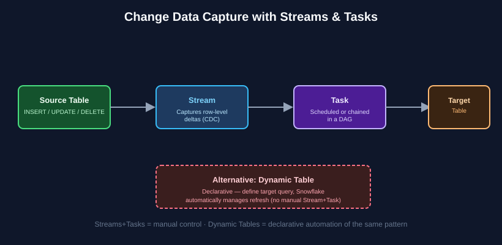

# Chapter 5: Data Transformation & Semi-Structured Data — SnowPro Core Study Notes

**Maps to official exam domain:** Performance Optimization, Querying & Transformation (**21%** of COF-C03 — this chapter covers the transformation half; performance/querying is [Chapter 6](../06-performance-optimization-querying/README.md))

**Prerequisite chapters:** [Chapters 1–4](../01-architecture-fundamentals/README.md)

**Next chapter:** [Chapter 6 — Performance Optimization & Querying](../06-performance-optimization-querying/README.md)

---

## 5.1 Core DML and DDL

SnowPro Core expects familiarity with standard SQL data manipulation and definition, plus a few Snowflake-specific behaviors:

- **DML**: `INSERT`, `UPDATE`, `DELETE`, and **`MERGE`** (upsert — insert or update depending on whether a match exists, extremely common in ELT pipelines).
- **DDL**: `CREATE`, `ALTER`, `DROP`, and **`CLONE`** (covered in [Chapter 1](../01-architecture-fundamentals/README.md#16-data-protection-features-that-live-in-this-domain) — zero-copy cloning is technically a DDL operation).
- **Transactions**: `BEGIN`, `COMMIT`, `ROLLBACK` — Snowflake supports explicit transactions, though many single statements auto-commit by default.

## 5.2 Semi-structured data types

Snowflake natively supports semi-structured data without requiring a rigid predefined schema, using three special data types:

| Type | Holds |
|---|---|
| **VARIANT** | Any semi-structured value (JSON object, array, or scalar) — the universal container type |
| **OBJECT** | A key-value pair collection (like a JSON object) |
| **ARRAY** | An ordered list of values |

Data loaded from JSON, Avro, ORC, Parquet, or XML is typically stored in `VARIANT` columns, and Snowflake automatically optimizes storage of `VARIANT` data by extracting and compressing sub-columns internally (transparent to the user).

## 5.3 Querying semi-structured data

### Dot and bracket notation

```sql
SELECT raw_data:customer.name::string AS customer_name
FROM orders;
```

The colon (`:`) accesses a key inside a VARIANT; `::string` (or `::int`, `::array`, etc.) casts the extracted value to a concrete type — casting is a very commonly tested syntax detail since VARIANT values are otherwise untyped.

### FLATTEN and lateral joins

`FLATTEN` is a table function that explodes an ARRAY or OBJECT into multiple rows — one row per element — commonly used to turn nested JSON arrays into a relational, queryable shape. It's typically used with a `LATERAL` join so each row can reference the flattened output of its own semi-structured column.

```sql
SELECT o.order_id, item.value:sku::string AS sku
FROM orders o, LATERAL FLATTEN(input => o.line_items) item;
```

**Exam tip:** know that `FLATTEN` is the mechanism for turning nested arrays/objects into rows — this is one of the most distinctive and commonly tested Snowflake SQL features.

## 5.4 Streams — change data capture (CDC)

A **Stream** is an object that records the row-level changes (inserts, updates, deletes) made to a table since the stream was last consumed. Querying a stream returns the delta rows plus metadata columns (`METADATA$ACTION`, `METADATA$ISUPDATE`, `METADATA$ROW_ID`) describing what changed.


*Streams capture row-level changes; Tasks (or Dynamic Tables) act on them. See [Snowflake's Streams docs](https://docs.snowflake.com/en/user-guide/streams-intro) for full detail.*

Streams enable incremental processing — instead of reprocessing an entire table, downstream logic only needs to touch what actually changed. Consuming a stream (e.g., via `INSERT ... SELECT * FROM my_stream`) inside a transaction advances its offset.

## 5.5 Tasks — scheduling and orchestration

A **Task** executes a single SQL statement (often a stored procedure call) on a schedule (cron-like or fixed interval) or when triggered. Tasks can be chained into a **DAG** (directed acyclic graph) where a child task runs after its predecessor completes, enabling multi-step pipelines.

A very common and exam-relevant pattern: **a Task scheduled to run whenever its associated Stream has data** (`SYSTEM$STREAM_HAS_DATA()`), which avoids running the task on a fixed schedule when there's nothing new to process.

Tasks can run on either a **user-managed warehouse** or **Snowflake-managed serverless compute** (see [Chapter 2](../02-virtual-warehouses-compute/README.md#27-serverless-features-compute-without-warehouses)).

## 5.6 Dynamic Tables — declarative alternative to Streams + Tasks

**Dynamic Tables** let you define a target table using a query, and Snowflake automatically and incrementally refreshes it to keep it up to date with a configurable target lag — without you manually writing Stream + Task orchestration logic. They're a newer, more declarative alternative to the classic Stream+Task pattern for keeping derived tables in sync with source data.

**Exam tip:** if a scenario describes wanting an always-fresh derived/aggregated table without manually managing streams, tasks, and merge logic, Dynamic Tables are usually the more modern answer.

## 5.7 User-Defined Functions (UDFs) and stored procedures

- **UDFs** compute and return a value, and can be written in **SQL**, **JavaScript**, **Python**, or **Java**. UDFs are used inline within SQL statements, like built-in functions.
- **Stored procedures** encapsulate procedural logic (loops, conditionals, multiple statements) and can be written in **JavaScript**, **Snowflake Scripting** (SQL-based procedural extension), or **Python** (via Snowpark). Stored procedures are called explicitly (`CALL my_proc()`), not used inline in expressions like UDFs.

**Exam tip:** the UDF vs. stored procedure distinction — "returns a value used in an expression" (UDF) vs. "performs a sequence of operations, possibly with side effects" (stored procedure) — is a common conceptual question.

## Key takeaways

- VARIANT/OBJECT/ARRAY are Snowflake's semi-structured types; use `:` to navigate and `::type` to cast.
- `FLATTEN` (usually with `LATERAL`) turns nested arrays/objects into queryable rows.
- Streams capture row-level change data; Tasks schedule/orchestrate work, often triggered by "stream has data."
- Dynamic Tables are a declarative alternative to manually wiring Streams + Tasks.
- UDFs return values used in expressions; stored procedures run multi-step procedural logic.

## Official documentation for further reading

- [Semi-structured data types overview](https://docs.snowflake.com/en/sql-reference/data-types-semistructured)
- [FLATTEN function](https://docs.snowflake.com/en/sql-reference/functions/flatten)
- [Introduction to Streams](https://docs.snowflake.com/en/user-guide/streams-intro)
- [Introduction to Tasks](https://docs.snowflake.com/en/user-guide/tasks-intro)
- [Introduction to Dynamic Tables](https://docs.snowflake.com/en/user-guide/dynamic-tables-about)
- [Stored procedures overview](https://docs.snowflake.com/en/sql-reference/stored-procedures-overview)

---

**Previous:** [← Chapter 4 — Data Loading, Unloading & Connectivity](../04-data-loading-unloading-connectivity/README.md)
**Next:** [Chapter 6 — Performance Optimization & Querying →](../06-performance-optimization-querying/README.md)
**Test yourself:** [Chapter 5 practice questions →](QUESTIONS.md)
