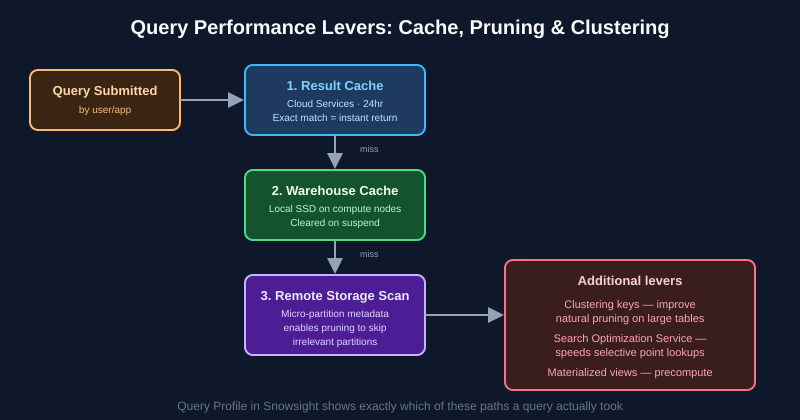

# Chapter 6: Performance Optimization & Querying — SnowPro Core Study Notes

**Maps to official exam domain:** Performance Optimization, Querying & Transformation (**21%** of COF-C03 — this chapter covers the performance half; transformation is [Chapter 5](../05-data-transformation-semi-structured/README.md))

**Prerequisite chapters:** [Chapters 1–5](../01-architecture-fundamentals/README.md)

**Next chapter:** [Chapter 7 — Data Protection, Sharing & Collaboration](../07-data-protection-sharing-collaboration/README.md)

---

## Why this chapter matters

Performance questions on SnowPro Core are almost always scenario-based: "a query is slow / expensive — what's the most direct fix?" Knowing which lever addresses which symptom (rather than memorizing definitions in isolation) is what actually earns points here.

## 6.1 The Query Profile

The **Query Profile** (in Snowsight) is Snowflake's visual breakdown of exactly how a query executed — showing each operator node (scans, joins, aggregations), time spent per node, bytes scanned, partitions scanned vs. total, and spillage to local/remote disk. It's the primary diagnostic tool for understanding *why* a specific query is slow.

*A query checks caches before scanning storage, and pruning/clustering reduce how much of storage actually needs scanning. See [Snowflake's query profile docs](https://docs.snowflake.com/en/user-guide/ui-query-profile) for full detail.*

## 6.2 The three caching layers (recap and depth)

| Cache | Layer | Scope | Persists through warehouse suspend? |
|---|---|---|---|
| **Result cache** | Cloud Services | Account-wide; reused by any warehouse if the exact same query text + unchanged underlying data | Yes, up to 24 hours |
| **Local disk (warehouse) cache** | Compute | Specific to the warehouse that ran the query | No — cleared on suspend |
| **Metadata cache** | Cloud Services | Micro-partition statistics used for pruning/optimization | Yes |

**Exam tip:** the result cache requires the query to be **byte-for-byte identical** (not just logically equivalent) and the underlying data to be unchanged since the cached result was produced.

## 6.3 Pruning and clustering

**Pruning** is the optimizer's ability to skip scanning micro-partitions that can't possibly contain rows matching a query's filter, based on the automatically collected min/max metadata for each partition (see [Chapter 1](../01-architecture-fundamentals/README.md#13-micro-partitions-know-this-cold)).

**Clustering keys** are an optional table property that tells Snowflake how to co-locate similar values physically within micro-partitions, which improves pruning effectiveness for large tables (typically multi-terabyte) with a well-defined, frequently filtered column (like a date or customer ID). For smaller tables, Snowflake's natural data ordering is usually good enough and explicit clustering isn't needed.

**Automatic clustering** (also called reclustering) runs on Snowflake-managed serverless compute in the background to maintain clustering as new data is added — you don't manually trigger it.

**Exam tip:** clustering keys are a cost/performance trade-off — they consume background serverless credits to maintain, so they're recommended only for large tables with real pruning benefit, not applied broadly by default.

## 6.4 Search Optimization Service

The **Search Optimization Service** is a separately enabled (Enterprise+) feature that builds and maintains a specialized search access path to speed up highly selective **point lookup** queries (e.g., `WHERE customer_id = 'X'` or substring/equality searches on columns with high cardinality) — cases where clustering alone doesn't help enough. Like automatic clustering, its maintenance runs on serverless compute.

**Exam tip:** clustering keys help range-style/scan-heavy queries on large sorted-ish columns; Search Optimization Service specifically helps highly selective point-lookup/equality queries — know the distinction.

## 6.5 Materialized views

A **materialized view** stores the precomputed result of a query and automatically keeps it in sync as underlying data changes (maintenance also runs on serverless compute). Materialized views are useful when a query with meaningful transformation/aggregation cost is run repeatedly against data that doesn't change too frequently — trading storage and background maintenance cost for faster read performance. Materialized views are an **Enterprise edition and above** feature.

## 6.6 Warehouse sizing vs. multi-cluster (recap)

As covered in [Chapter 2](../02-virtual-warehouses-compute/README.md#23-scale-up-vs-scale-out-a-very-commonly-tested-distinction): scale **up** (bigger warehouse) for slow individual complex queries; scale **out** (multi-cluster) for queuing caused by concurrent users. This distinction re-appears constantly in performance-domain scenario questions.

## 6.7 Query Acceleration Service

The **Query Acceleration Service** offloads parts of eligible queries (particularly those with large scans and filtering, common in ad hoc/exploratory workloads) to additional serverless compute resources beyond the warehouse's normal size, to reduce the impact of occasional large/outlier queries without needing to permanently upsize the warehouse.

## 6.8 Spilling — a hidden performance killer

When a query's intermediate results (e.g., during a large sort or join) don't fit in a warehouse's available memory, Snowflake **spills** data first to local disk, and if that's also insufficient, to remote (cloud) storage. Remote spillage in particular is a major performance red flag visible in the Query Profile, and the direct fix is usually a **larger warehouse** (more memory available) rather than a code rewrite.

## Key takeaways

- Query Profile is the primary tool for diagnosing why a specific query is slow.
- Result cache needs an identical query + unchanged data; warehouse cache clears on suspend; metadata cache drives pruning.
- Clustering keys improve pruning on large, frequently filtered tables; Search Optimization Service targets selective point lookups instead.
- Materialized views precompute and maintain expensive, frequently-run query results (Enterprise+).
- Spilling to local/remote disk from insufficient warehouse memory is a common, Query-Profile-visible performance problem usually fixed by scaling up.

## Official documentation for further reading

- [Exploring execution times with Query Profile](https://docs.snowflake.com/en/user-guide/ui-query-profile)
- [Clustering keys and clustered tables](https://docs.snowflake.com/en/user-guide/tables-clustering-keys)
- [Search Optimization Service](https://docs.snowflake.com/en/user-guide/search-optimization-service)
- [Materialized views](https://docs.snowflake.com/en/user-guide/views-materialized)
- [Query Acceleration Service](https://docs.snowflake.com/en/user-guide/query-acceleration-service)

---

**Previous:** [← Chapter 5 — Data Transformation & Semi-Structured Data](../05-data-transformation-semi-structured/README.md)
**Next:** [Chapter 7 — Data Protection, Sharing & Collaboration →](../07-data-protection-sharing-collaboration/README.md)
**Test yourself:** [Chapter 6 practice questions →](QUESTIONS.md)
