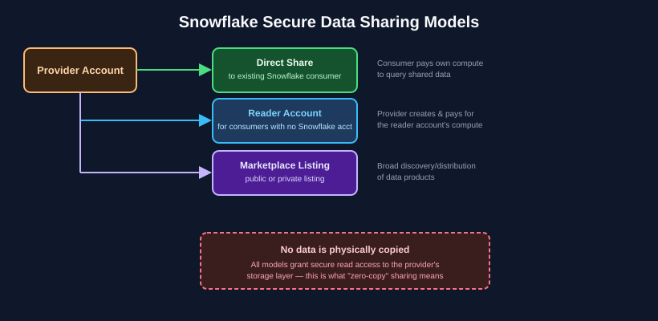

# Chapter 7: Data Protection, Sharing & Collaboration — SnowPro Core Study Notes

**Maps to official exam domain:** Data Collaboration (**10%** of COF-C03 — smallest domain by weight, but with several very memorizable, high-yield facts)

**Prerequisite chapters:** [Chapter 1](../01-architecture-fundamentals/README.md) (Time Travel, Fail-safe, cloning basics), [Chapter 3](../03-account-access-security-governance/README.md) (RBAC)

**Next chapter:** [Chapter 8 — AI, Iceberg, Notebooks & Git Integration](../08-ai-cortex-iceberg-notebooks-git/README.md)

---

## 7.1 Time Travel and Fail-safe, in depth

Covered briefly in [Chapter 1](../01-architecture-fundamentals/README.md#16-data-protection-features-that-live-in-this-domain); here's the exam-relevant depth:

- **Time Travel** lets you query or restore historical data using `AT` or `BEFORE` clauses referencing a timestamp, offset, or query ID:

```sql
SELECT * FROM orders AT (TIMESTAMP => '2026-07-20 09:00:00'::timestamp);
SELECT * FROM orders BEFORE (STATEMENT => '<query_id>');
UNDROP TABLE orders;  -- restore a dropped table within the Time Travel window
```

- Retention period: **0–1 day on Standard** edition (configurable, including disabling it entirely at 0), **up to 90 days on Enterprise and above**.
- **Fail-safe** is a **non-configurable, non-self-service 7-day period** that begins immediately after Time Travel retention expires. Only Snowflake support can recover data during Fail-safe, and it exists as a last-resort disaster recovery mechanism — it is explicitly **not** a substitute for a backup strategy you control.

**Exam tip:** "can a user self-service recover data during Fail-safe?" — no, that's the single most commonly tested Fail-safe fact.

## 7.2 Zero-copy cloning (recap)

`CREATE TABLE new_table CLONE existing_table` (or `SCHEMA`/`DATABASE` equivalents) creates an instant, metadata-only copy that initially shares the same micro-partitions as the source. Storage cost is only incurred once data in either the clone or the original diverges. Clones are commonly used to spin up dev/test environments from production data instantly and cheaply.

## 7.3 Secure Data Sharing

Snowflake's **Secure Data Sharing** lets a **provider** account grant a **consumer** account live, read-only access to specific databases/schemas/tables — without physically copying any data. The consumer queries the provider's data directly through Snowflake's storage layer.


*Snowflake's data sharing models all avoid physically copying data. See [Snowflake's data sharing docs](https://docs.snowflake.com/en/user-guide/data-sharing-intro) for full detail.*

### Who pays for compute? (a classic exam question)

| Sharing model | Who pays for compute to query shared data? |
|---|---|
| **Direct share** to a consumer with their own Snowflake account | The **consumer** pays for their own warehouse compute |
| **Reader account** (for a consumer without their own Snowflake account) | The **provider** creates and pays for the reader account's compute |

**Exam tip:** memorize this table — "who pays for what" in sharing scenarios is a frequently tested, easy-to-get-wrong detail.

## 7.4 Reader accounts

A **reader account** is a special, provider-managed Snowflake account created specifically to let organizations **without their own Snowflake account** consume shared data. The provider account creates it, controls it, and bears its compute cost. It's a common onboarding path for sharing data with a smaller partner or customer who isn't yet a Snowflake customer themselves.

## 7.5 Snowflake Marketplace

The **Snowflake Marketplace** is a platform for publishing and discovering shareable data products (datasets, and increasingly apps/services) across organizations, beyond a single direct provider-consumer relationship. Listings can be:

- **Public** — discoverable broadly across the Marketplace
- **Private** — shared with specific, named accounts or organizations only

Marketplace listings still use the same underlying zero-copy Secure Data Sharing mechanism — no data is duplicated to consumers.

## 7.6 Data Clean Rooms (conceptual awareness)

**Data Clean Rooms** allow two or more parties to collaborate on and analyze combined data **without either party directly exposing their raw underlying data** to the other — useful for use cases like joint marketing analytics between companies who don't want to hand over raw customer data. For SnowPro Core, conceptual awareness of what a clean room accomplishes is sufficient; deep implementation detail is more of an Advanced-track topic.

## 7.7 Native Apps (brief awareness)

The **Snowflake Native App Framework** lets providers build and distribute full applications (not just data) that run inside a consumer's own Snowflake account, using the consumer's own compute. This is a newer extension of the sharing/collaboration ecosystem beyond pure data sharing.

## Key takeaways

- Time Travel: 0–1 day (Standard) vs. up to 90 days (Enterprise+); Fail-safe is a fixed 7-day, Snowflake-only recovery window afterward.
- Zero-copy clones share underlying micro-partitions until data diverges.
- In direct shares, the consumer pays compute; in reader accounts, the provider pays compute — memorize this distinction.
- Snowflake Marketplace listings can be public or private but use the same underlying zero-copy sharing mechanism.
- Data Clean Rooms enable collaborative analysis without exposing raw data between parties.

## Official documentation for further reading

- [Understanding & using Time Travel](https://docs.snowflake.com/en/user-guide/data-time-travel)
- [Understanding & viewing Fail-safe](https://docs.snowflake.com/en/user-guide/data-failsafe)
- [Introduction to Secure Data Sharing](https://docs.snowflake.com/en/user-guide/data-sharing-intro)
- [Managing Reader Accounts](https://docs.snowflake.com/en/user-guide/data-sharing-reader-create)
- [Snowflake Marketplace overview](https://docs.snowflake.com/en/user-guide/data-marketplace)

---

**Previous:** [← Chapter 6 — Performance Optimization & Querying](../06-performance-optimization-querying/README.md)
**Next:** [Chapter 8 — AI, Iceberg, Notebooks & Git Integration →](../08-ai-cortex-iceberg-notebooks-git/README.md)
**Test yourself:** [Chapter 7 practice questions →](QUESTIONS.md)
