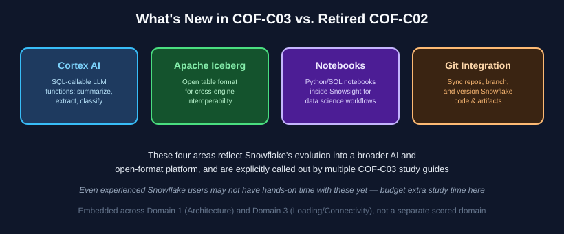

# Chapter 8: AI, Iceberg, Notebooks & Git Integration — What's New in COF-C03

**Maps to official exam domains:** primarily Snowflake AI Data Cloud Features & Architecture (**31%**) and Data Loading, Unloading & Connectivity (**18%**, for Git integration specifically) — this content is woven into COF-C03's existing domains rather than scored as its own separate domain, but it's broken out into its own chapter here because it's genuinely new material most experienced Snowflake users haven't touched yet.

**Prerequisite chapters:** [Chapter 1](../01-architecture-fundamentals/README.md), [Chapter 4](../04-data-loading-unloading-connectivity/README.md)

**Previous chapters cover the rest of the exam** — this is the final content chapter before the [mock exam](../../assessments/MOCK_EXAM.md).

---

## Why this chapter matters

COF-C03 replaced COF-C02 specifically to reflect Snowflake's expansion into AI and open-format interoperability. Multiple independent COF-C03 study guides flag **Cortex AI, Apache Iceberg tables, Snowflake Notebooks, and Git integration** as the headline new content — and because they're new, even candidates with real Snowflake production experience may need dedicated study/lab time here that they don't need elsewhere.


*What's genuinely new in COF-C03 relative to the retired COF-C02. See [Snowflake's Cortex AI docs](https://docs.snowflake.com/en/user-guide/snowflake-cortex/aisql) and [Iceberg tables docs](https://docs.snowflake.com/en/user-guide/tables-iceberg) for full detail.*

## 8.1 Snowflake Cortex AI

**Cortex AI** is Snowflake's suite of SQL-callable AI/LLM functions that let you apply generative AI directly to data sitting inside Snowflake, without moving it to an external service.

At the SnowPro Core level, you need **awareness of the capability categories**, not deep ML expertise:

- **Text functions**: summarization, translation, sentiment analysis, entity extraction — callable directly in SQL against staged or table text data.
- **Cortex Analyst**: a natural-language-to-SQL capability that lets business users ask questions in plain English against structured data.
- **Cortex Search**: search/retrieval functionality over both structured and unstructured data (relevant to RAG-style patterns).
- **Cortex Agents / multimodal functions**: newer, broader capabilities combining reasoning, tool use, and multiple data modalities.

**Why it matters for the exam:** the core "why" to remember is that Cortex functions let AI processing happen **inside Snowflake's security/governance boundary** — the data doesn't need to leave Snowflake to be summarized, classified, or searched, which matters a lot for regulated data.

```sql
SELECT SNOWFLAKE.CORTEX.SUMMARIZE(review_text) AS summary
FROM product_reviews;
```

## 8.2 Apache Iceberg Tables

**Apache Iceberg** is an open table format (originally developed outside Snowflake) that stores table metadata in an open, standardized way, enabling **multiple compute engines** (Snowflake, Spark, Trino, and others) to read and write the same underlying data.

- Snowflake supports creating and querying **Iceberg tables**, using Snowflake as the catalog (or an external catalog like AWS Glue).
- **Why choose Iceberg over a native Snowflake table:** interoperability — when other tools/engines outside Snowflake need to read or write the same data without a proprietary format lock-in, or when data already lives in a data lake in Iceberg format.
- **Why choose a native table instead:** tighter integration with Snowflake-specific features and generally simpler operational management if nothing outside Snowflake needs direct access to the files.

**Exam tip:** a scenario describing "multiple different processing engines need to read/write the same table outside of Snowflake" points toward Iceberg tables; "everything happens inside Snowflake" points toward native tables.

## 8.3 Snowflake Notebooks

**Notebooks** bring a Jupyter-style, cell-based Python/SQL interactive environment directly into Snowsight, letting data scientists and engineers explore data, build visualizations, and prototype pipelines without leaving the Snowflake UI or moving data elsewhere.

Key exam-relevant awareness points:

- Notebooks run using Snowflake compute (a warehouse, or in some cases container-based compute for more demanding workloads) — the code executes where the data lives, rather than pulling data out to a local machine.
- They support mixing SQL and Python cells in the same notebook, useful for combining data prep (SQL) with analysis/visualization (Python).

## 8.4 Git Integration

Snowflake's **Git integration** lets you connect a Git repository (GitHub, GitLab, etc.) directly to a Snowflake account, so Snowflake maintains a synced clone of the repo that database objects (like stored procedures or Python function handlers) can reference directly.

- Enables version control and CI/CD-style workflows for Snowflake code (SQL scripts, Snowpark Python, stored procedure logic) using the same Git tooling teams already use for application code.
- A commit/push round-trip lets changes made in a Git-backed workflow show up as referenceable files inside Snowflake.

**Exam tip:** know conceptually *where the files live* — Git integration works via a Snowflake-managed clone of the repository, not a live, real-time mount of the external Git service.

## 8.5 How to actually study this section

Because this material is genuinely new, reading alone won't be enough — build a small lab for each:

1. **Cortex AI lab:** stage two short text files, run a summarization function on one and an extraction function on the other.
2. **Iceberg lab:** create a basic Iceberg table using Snowflake as the catalog, insert sample rows, and compare its DML/maintenance behavior to a native table.
3. **Notebook lab:** create a Python/SQL notebook in Snowsight, run a small exploratory query, and produce a simple chart.
4. **Git lab:** link a Git repository, browse its files from within Snowflake, and reference a repo file from a Snowflake object.

## Key takeaways

- Cortex AI brings SQL-callable AI/LLM functions inside Snowflake's governance boundary — no need to move data externally.
- Iceberg tables trade some Snowflake-native convenience for open, cross-engine interoperability.
- Notebooks bring an interactive Python/SQL environment into Snowsight, running on Snowflake compute.
- Git integration syncs a repo clone into Snowflake so code objects can reference version-controlled files directly.
- This content is new enough in COF-C03 that hands-on labs matter more here than almost anywhere else in this guide.

## Official documentation for further reading

- [Snowflake Cortex AI overview](https://docs.snowflake.com/en/guides-overview-ai-features)
- [Iceberg tables in Snowflake](https://docs.snowflake.com/en/user-guide/tables-iceberg)
- [Snowflake Notebooks](https://docs.snowflake.com/en/user-guide/ui-snowsight/notebooks)
- [Git integration with Snowflake](https://docs.snowflake.com/en/developer-guide/git/git-overview)

---

**Previous:** [← Chapter 7 — Data Protection, Sharing & Collaboration](../07-data-protection-sharing-collaboration/README.md)
**Next:** [Full Mock Exam →](../../assessments/MOCK_EXAM.md)
**Test yourself:** [Chapter 8 practice questions →](QUESTIONS.md)
